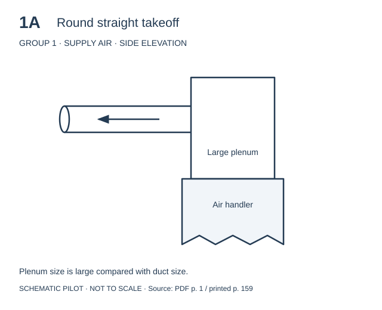
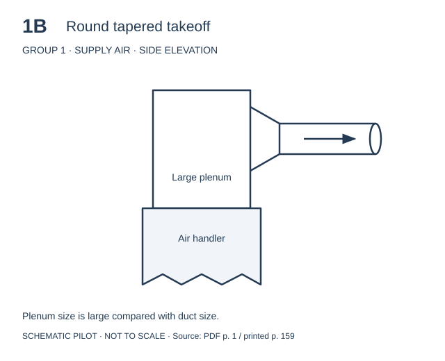
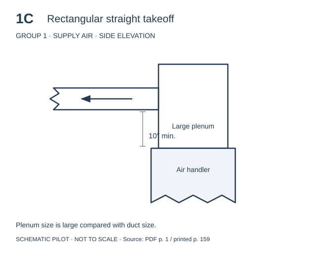
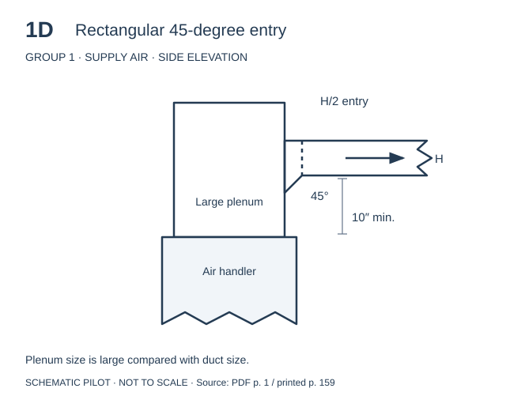
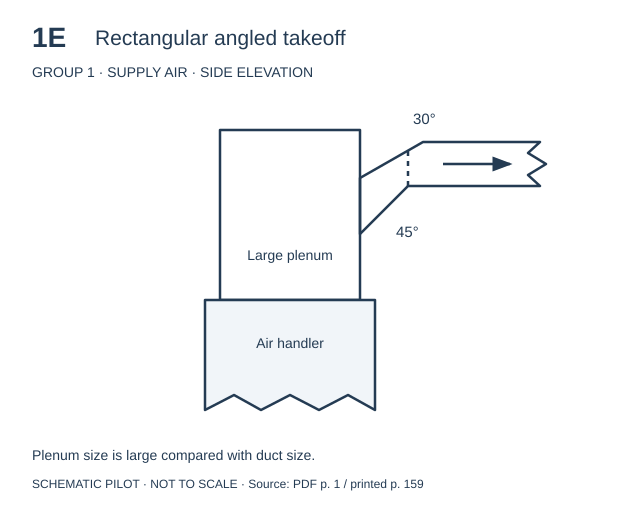

# Individual fitting drawings — pilot

See the latest [2B and 3T source-trace review](fitting-trace-review.md) for
side-by-side comparisons of the revised difficult fittings.

The follow-up [inventory and Groups 2–3 review sheet](fitting-inventory.md)
adds eight drawings and a combined catalog. Use
`python3 scripts/generate-fitting-complex-pilot.py` to regenerate the complete
current pilot; the original generator below produces only Group 1.

This pilot redraws **1A–1E** from `Public/files/ManD.Groups.pdf` (PDF page 1,
printed page 159) as separate SVG side elevations. It is a first review set,
not a conversion of all 50 PDF pages. The PDF contains raster scans, including
drawings shared by multiple fitting numbers, so automatic vector extraction
would not produce clean individual fittings.

## Review sheet

## Assets and future selection

- `Public/images/fittings/*.svg`: scalable standalone drawings with accessible
  titles and descriptions. Each isolates the connection for its fitting number.
- `Public/images/fittings/catalog.json`: stable IDs, group/letter fields, image
  URLs, source pages, conditions, notes, and review status.
- `scripts/generate-fitting-pilot.py`: deterministic generator, requiring only
  Python 3. Run from any directory to regenerate the SVGs and catalog.

The app's existing public-file middleware can serve these at
`/images/fittings/1A.svg` and `/images/fittings/catalog.json`. No application
routes, fitting selections, or calculations have been changed.

A future selector can display cards from the catalog, filter by group/system,
and use `group` and `letter` to populate the existing `FittingGroup` fields.
The catalog's `referenceEquivalentLengthFeet` is a transcription from the
source at its stated reference conditions (900 FPM and 0.08 IWC/100 feet),
not an implemented calculation or automatic value-selection rule.

## Review before expanding

These are schematic redraws, not dimensionally exact reproductions. They omit
the original perspective views and separate paired fittings into individual
side elevations. Descriptive names are editorial labels. Compare geometry,
clearances, angles, and reference values against the PDF before approving a
drawing; every entry currently carries `schematic-pilot-needs-review` status.

Once this visual approach is accepted, inventory the remaining fittings and
variants, assign each a stable ID, and redraw/review them in batches. Preserve
source pages and fitting-specific conditions rather than assuming every group
uses Group 1's reference conditions.
