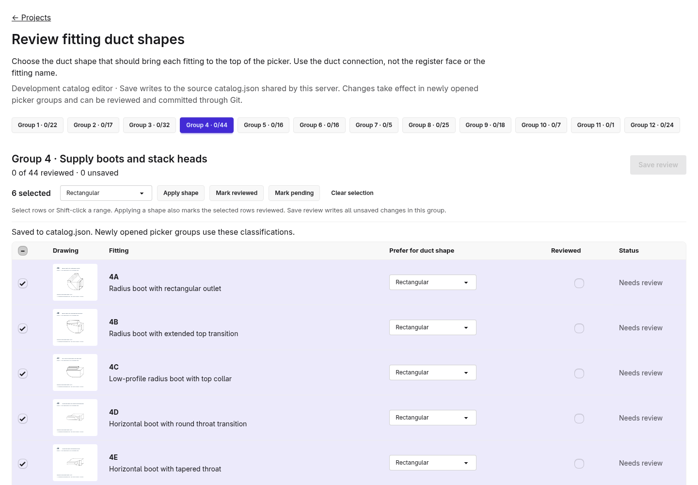
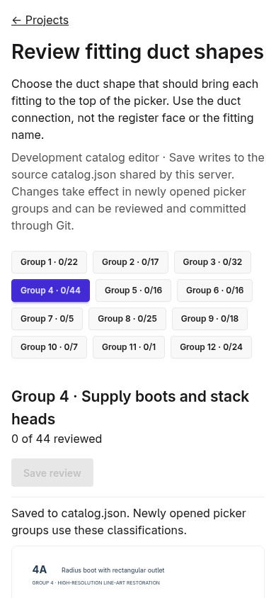

# Review duct-shape classifications in development

Open **`http://localhost:8081/fittings/review?group=4`** through the existing SSH port
forward, and sign in with your review-app account. The picker also links to **Review
catalog duct shapes** when this feature is enabled.

1. Select a group. The compact table shows a drawing, fitting name, duct shape, and
   review status for each fitting. Click a drawing to open it at full size.
2. Select individual rows, **Shift-click** a range, or use the header checkbox to
   select the entire group. Selection alone makes no catalog changes.
3. Choose a duct shape in the bulk toolbar and click **Apply shape** to classify all
   selected rows and mark them reviewed. **Mark reviewed** confirms their existing
   shapes; **Mark pending** clears review status without changing shapes. Individual
   row controls remain available for exceptions.
4. Click **Save review** to write all unsaved changes in this group, including rows
   no longer selected. Changed rows and the unsaved count show the pending work;
   leaving with unsaved choices triggers the browser's confirmation. Selection
   persists after saving and **Clear selection** only clears the row selection.
5. Reopen the fitting group in the picker to see the saved ordering. Existing open
   picker cards retain their current draft until that group is reopened.





## One source for classification

[`Sources/FittingClient/Resources/catalog.json`](../Sources/FittingClient/Resources/catalog.json)
is the authored runtime catalog. Schema version 2 requires these fields on every fitting:

```json
"ductShape": "rectangular",
"ductShapeReviewed": false
```

`ductShape` controls presentation order in Favorites and All fittings. It is distinct
from `shape`, which describes the overall artwork and remains relevant to artwork
lookup and calculation variants. The previous Group 2/4 view-code exceptions have
been removed. Their current values were migrated into the catalog; other entries
start with their previous shape classifications. All entries initially say **Needs
review**, including the assistant-audited Group 2/4 entries. Review status does not
hide a fitting or disable its calculations.

User reviews are now saved for **189 fittings in Groups 2–4 and 6–12**.
Groups **1 and 5** remain pending. The Group 11 junction box is classified as
shape-independent. Groups 1 and 5 need a separate decision about how equipment
connections should establish the preference for subsequent fitting selections;
the current picker still uses the manual preference toggle.

The review page changes **only** `ductShape` and `ductShapeReviewed` for submitted IDs.
It preserves the rest of the JSON and its formatting, so Git diffs show the actual
review decisions. Unknown IDs, duplicate IDs, missing fields, and invalid enum values
are rejected. The development store serializes saves, reloads externally edited
source data, and rejects a stale page if the file changed. A failed save retains the
in-page choices. Catalog formatting outside the supported authored layout is rejected
without rewriting the file.

Saving writes to the checkout, **not browser storage or the project database**. The
server uses the updated source immediately. Changes persist through server restarts.
They remain normal uncommitted Git changes until committed and pushed; the page does
not perform Git operations. Production builds package the same reviewed source file.
The separate artwork manifests and frozen prototype generator do not generate or
replace this runtime catalog.

## Enable the review server

Catalog editing is disabled by default. App configuration enables it only in Vapor's
**development** environment when `FITTING_CATALOG_REVIEW_PATH` names a source file.
Both review routes require an authenticated user. Enable this on a trusted development
server; every signed-in user of that server can review the shared catalog.

The regular production client continues to load its bundled catalog once. It exposes
no review writes, including when a source path happens to be set in a production or
testing environment. Development clients read the configured source and refresh it
when its bytes change.

The current review server uses the existing disposable review database and the real
checkout's source catalog. Run as the checkout owner so saved files remain editable:

```sh
docker run --rm --user "$(id -u):$(id -g)" --name fitting-picker-preview \
  -p 8081:8080 \
  -e SQLITE_PATH=/review-data/db.sqlite \
  -e FITTING_CATALOG_REVIEW_PATH=/workspace/Sources/FittingClient/Resources/catalog.json \
  -v /tmp/fitting-integration-review:/review-data \
  -v "$PWD:/workspace" -w /workspace swift:6.2-noble \
  .build/debug/App serve --hostname 0.0.0.0 --port 8080
```

The review-data directory must be writable by the same user. Stop the existing
container before restarting it. Omit `FITTING_CATALOG_REVIEW_PATH` for ordinary app
operation.

## Validation

**144 Swift tests in 32 suites pass.** Review coverage verifies exact two-line metadata
edits, production/development agreement, unchanged calculation results, required
metadata, stale and concurrent saves, invalid submissions, and preservation of source
formatting. View tests check every card against its catalog classification without
maintaining a second classification table in Swift.

The browser review test uses a **disposable catalog copy and database**, resets
review status to pending in that test copy, and verifies
login requirements, edits/saves/reloads classifications, checks the live picker
fragment, rejects stale/invalid writes, restores the exact original file through the
UI, tests range/select-all bulk edits and failed-save retry, and checks desktop/mobile
layouts:

```sh
FITTING_REVIEW_URL=http://localhost:YOUR_QA_PORT \
FITTING_REVIEW_CATALOG=/tmp/YOUR_QA_DIRECTORY/catalog.json \
node scripts/check_catalog_review.cjs
```

The test server's `FITTING_CATALOG_REVIEW_PATH` must point to that disposable copy.
Do not run this authoring test against the active checkout's catalog.
