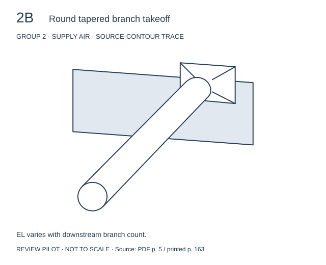
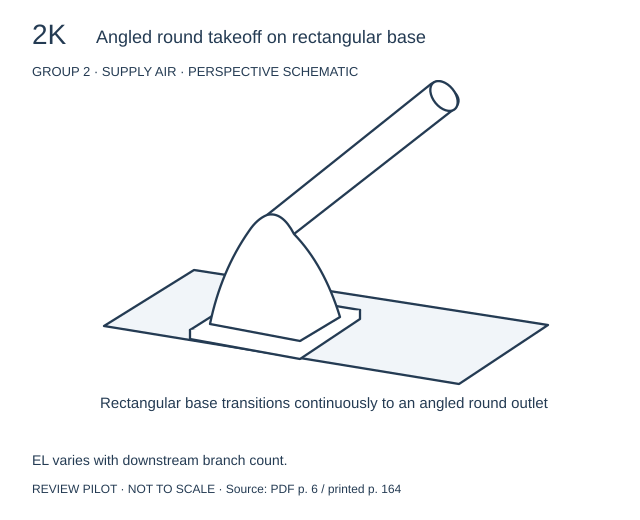
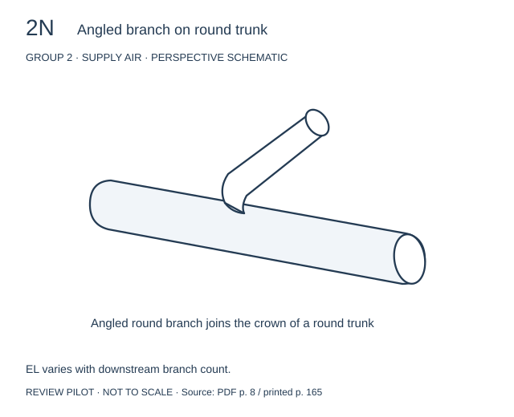
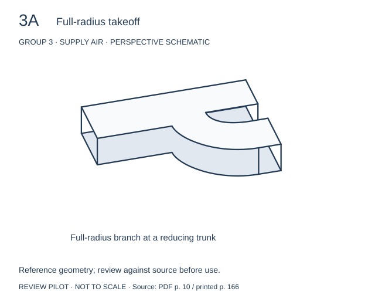
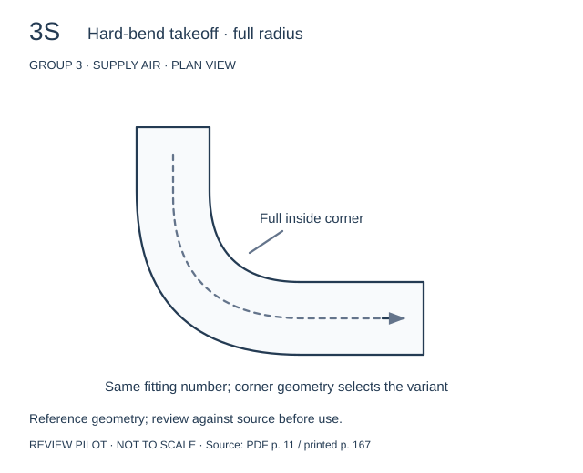
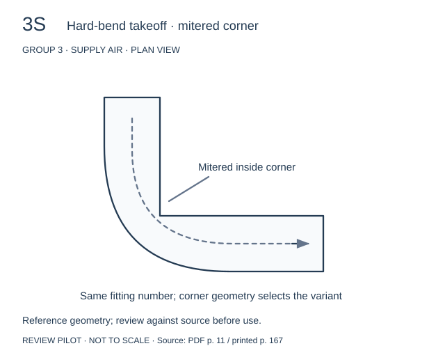
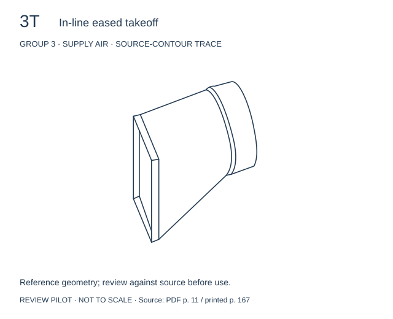

# Fitting inventory and complex drawing pilot

**Completed:** [Group 1 review](group-1-review.md), covering all 19 source fitting
numbers in 22 visually approved drawings.

**Current batch:** [Group 2 review](group-2-review.md), with all 17 fittings
drawn. Fourteen new drawings await review.

**Updated review:** [2B and 3T source comparisons](fitting-trace-review.md).
These two assets now use manual source-contour traces; other drawings below
remain the earlier schematic interpretations.

The completed pilot batch review accepted all 13 existing drawings. The
remaining fittings listed below still need drawings.

## PDF inventory

The 50 PDF pages contain 29 embedded source-page images. Some source pages
span PDF page breaks, and Group 3 appears twice. PDF page numbers below are
one-based navigation ranges, not the printed book page numbers. This is a
group-level visual inventory; Groups 1, 2 and 3 now have a fitting-level inventory
in this pass.

| Group | Subject | PDF pages | Drawing / data considerations |
| --- | --- | --- | --- |
| 1 | Supply air fittings at equipment | 1–4 | Paired connections; radius, vane and aspect-ratio variants. Existing pilot: 1A–1E. |
| 2 | Supply trunk branch takeoffs | 5–9 | Perspective views; rectangular and round trunks; downstream branch counts. |
| 3 | Reducing trunk takeoffs | 10–17 | Assemblies, shared detail drawings, corner variants. Repeated source pages. |
| 4 | Supply boots and stack heads | 18–19 | Many compact perspective shapes; orientation matters. |
| 5 | Return fittings at equipment | 20–24 | Shared drawings, dimensions and conditional values. |
| 6 | Return trunk branches and return boots | 25–29 | Flow-ratio tables, branch/trunk paths and multiple views. |
| 7 | Panned joists and stud returns | 30–31 | Building context and airflow-dependent tables. |
| 8 | Elbows and offsets | 32–35 | Radius, aspect ratio, angle and vane variants. |
| 9 | Supply trunk junctions | 36–39 | Distinct main and branch paths; multiple-port fittings. |
| 10 | Return trunk junctions | 40–41 | Distinct main and branch paths. |
| 11 | Flexible duct junctions and bends | 42–43 | Routing, bend radius and compression are significant. |
| 12 | Transitions and oval squeezes | 44–48 | Diverging/converging direction, area ratios, velocity. |
| 13 | Manual balancing dampers | 49–50 | Round and rectangular forms; pressure-loss data. |

## Group 2 — 17 fitting numbers

| Source printed page | Fitting numbers | Status |
| --- | --- | --- |
| 163 | 2A, 2B, 2C, 2D, 2E, 2F, 2G, 2H | All eight drawn; 2B previously accepted |
| 164 | 2I, 2J, 2K, 2L, 2M | All five drawn; 2K previously accepted |
| 165 | 2N, 2O, 2P, 2Q | All four drawn; 2N previously accepted |

Each fitting has six reference EL values: downstream branch counts 0, 1, 2, 3,
4, and 5 or more. Count to the end of the trunk or the next reducer; begin a new
count after a reducer. The new catalog records all six values for each drawn
Group 2 fitting, rather than assigning a single value.

## Group 3 — 23 fitting numbers, plus variants

| Fitting numbers | Source assembly / distinction | Status |
| --- | --- | --- |
| 3A, 3I | Full-radius takeoff | 3A drawn; 3I placement not separately drawn |
| 3B, 3L | Full-radius takeoff plus offset transition | Pending |
| 3C, 3K | Full-radius takeoff plus straight transition | Pending |
| 3D, 3J | Takeoff elbow plus easy-bend elbow; three inside-corner choices | Pending |
| 3E | Transition wall takeoff | Pending |
| 3F | Transition wall takeoff elbow plus easy-bend elbow; EL references 3D + 15 | Pending |
| 3G | Transition wall takeoff plus straight-aspect transition | Pending |
| 3H | Transition wall takeoff plus offset-aspect transition | Pending |
| 3M, 3N | In-line eased takeoff plus one / two elbows | Pending |
| 3O, 3R | Transition wall eased takeoff | Pending |
| 3P, 3Q | Transition wall eased takeoff plus two / one elbows | Pending |
| 3S | Hard-bend takeoff: full, tight, mitered inside corner | Three separate plan-view assets |
| 3T | In-line eased takeoff | Drawn |
| 3U | Overview/detail descriptions and values differ | Unresolved; no asset |
| 3V | Additional detail on printed page 167 | Pending |
| 3W | Additional detail on printed page 167 | Pending |

Printed pages 166–167 contain the Group 3 overview and details. In the overview,
3S and 3U share 15/35/90-foot values for full/tight/mitered inside corners. The
detail page instead labels a mitered 3U with 10 feet with vanes and 80 without.
This discrepancy is recorded in `catalog.json.sourceIssues`; do not silently
choose one table. The 3S detail independently confirms 15/35/90.

The overview also says to add 15 feet when a round sleeve is simply butted to
the transition wall. That assembly condition must be preserved when those
fittings are implemented.

## New drawings

These are review schematics, not fabrication geometry. Perspective drawings
show connection shape; the 3S plan views deliberately emphasize the inside
corner. The 3S views do not reproduce the perspective detail's rectangular
aspect ratio. Names are descriptive labels, not a new numbering system.

## Catalog and regeneration

Run `python3 scripts/generate-fitting-complex-pilot.py` to regenerate both
pilots: 13 SVGs representing 11 fitting numbers. It first regenerates Group 1,
then writes the combined schema-version-2 catalog. Running the original Group 1
script alone replaces the catalog with its original five-entry pilot.

Reference conditions now live on each entry, because later groups use different
conditions. A variant asset has a unique `id` such as `3S-full`, while its
`fittingNumber`, `group` and `letter` remain `3S`, `3` and `S`.
Group 2 entries use `referenceEquivalentLengthByDownstreamBranches`; a null
upper branch-count bound means five or more. These reference transcriptions
have not been connected to the app's calculations.

Before building a selector, decide how it will collect branch count, corner
variant, and assembly conditions. A fitting number alone is insufficient for
these groups. Next drawing batches can complete Group 2, then handle Group 3
assemblies with consistent inlet, outlet and trunk context.
