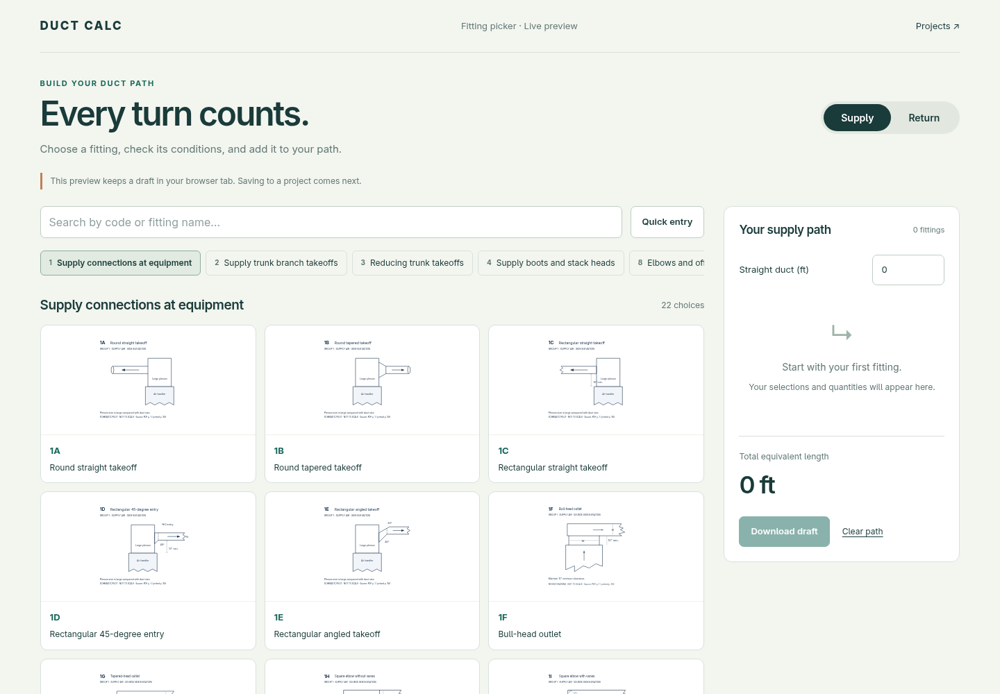
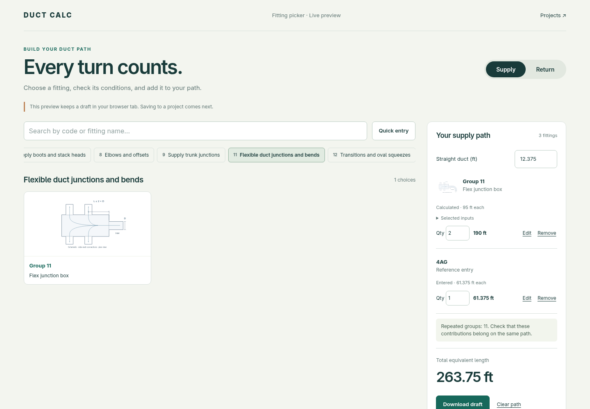

# Live fitting picker review

The live Swift application now serves `/fittings` with **227 catalog choices across
groups 1–12**. Every calculation uses `FittingClient`; the JavaScript manages draft
state, quantities, and straight-duct arithmetic. No fitting table is duplicated in
JavaScript. The frozen HTML prototypes remain separate.

## Review the UI

Open `/fittings?type=supply` or `/fittings?type=return` on your development server.
Step 3 of the existing equivalent-length form also links to the preview in a new tab.
No login is needed to browse the catalog. The preview has no access to project data.

On the remote host, the review server is running on port **8081**. Forward that port
through your SSH client and open `http://localhost:8081/fittings` locally. For example,
replace `YOUR_HOST` with your usual SSH host:

```sh
ssh -N -L 8081:localhost:8081 michael@YOUR_HOST
```

GitHub screenshots are below. Suggested review flow:

1. Browse or search across the eligible groups, then open a fitting and its full-size drawing.
2. Try **8O**: the new draft starts at **Mitered**. The other printed categories remain explicit.
3. Try **Group 11**: one **Velocity in flex duct** control. At 700 FPM the box is 60 ft;
   enabling the supplied bend with its default 700 FPM and R/D 1.0 gives 75 ft.
   Bend inputs retain their values when toggled off and back on. The bend-detail
   drawing is linked below the configuration.
4. On a return path, try **Group 6**: enter branch and combined airflow, then choose
   the branch or trunk contribution. Unavailable trunk cells cannot be added.
5. Add quantities and straight duct, edit a fitting, and try **Quick entry** with
   `4AG` and a supplied `61.375` ft. Entered values remain entered values, without
   inferring a construction or replacing them with a calculated table value.
6. Download the draft JSON to inspect calculation snapshots and source conditions.







## Scope and next step

Supply and return drafts are stored independently in `sessionStorage` for this browser
tab. Reloading retains them. If browser storage is unavailable, the page explains
that the draft is in memory only. Downloaded JSON contains unrounded values,
quantities, selected inputs, calculation components, revisions, derivations,
Group 6 column selection, and any upstream-pressure requirement.

**This preview does not save to a project.** Its JSON is a review/export artifact,
not a supported import format. The next slice connects the reviewed picker to
`ProjectClient` and step-3 persistence: re-evaluate calculated rows on save, preserve
entered/legacy values, and retain snapshots without trusting browser totals.
Favorites, CSV integration, and project-provided input suggestions follow that work.

## Run and verify

With Swift 6.2, use `swift run App serve --hostname 0.0.0.0 --port 8080` and open
`/fittings`. To reproduce the isolated Docker review server from the repository root:

```sh
docker run --rm -v "$PWD:/workspace" -w /workspace swift:6.2-noble swift build --jobs 4
docker run --rm --name fitting-picker-preview -p 8081:8080 \
  -e SQLITE_PATH=/tmp/fitting-picker-preview.sqlite \
  -v "$PWD:/workspace" -w /workspace swift:6.2-noble \
  .build/debug/App serve --hostname 0.0.0.0 --port 8080
```

The container's temporary database is separate from the repository's development database.
Stop it with `docker stop fitting-picker-preview` before starting another on the same port.

Validation: the full Swift suite passed **135 tests in 30 suites**. The six picker
checks cover all catalog defaults through form transport, missing versus defaulted
inputs, Group 11's velocity contract, Group 6's paired contributions, fractional
reference entries, malformed input, and path eligibility. Targeted picker tests
also passed after the final drawing-link change.

Browser checks cover add/edit/remove controls, quantities, fractional totals,
reload persistence, separate path types, retained bend inputs, stale result
invalidation, Group 6 selection, and desktop/mobile layouts without horizontal
page overflow. Screenshots use the live server, not mock data.

With Playwright and its Chromium browser installed, the repeatable browser checks are:

```sh
FITTING_PICKER_URL=http://localhost:8081 node scripts/check_live_fitting_picker.cjs
FITTING_PICKER_URL=http://localhost:8081 node scripts/check_live_fitting_picker_edges.cjs
```

If Playwright is installed outside this checkout, set `NODE_PATH` to its containing
`node_modules` directory. The edge checks exercise matching-elbow derivations and
edits, upstream-pressure conditions, exported snapshots, and cancellation of stale
server responses. The main check writes temporary screenshots under `/tmp`.
