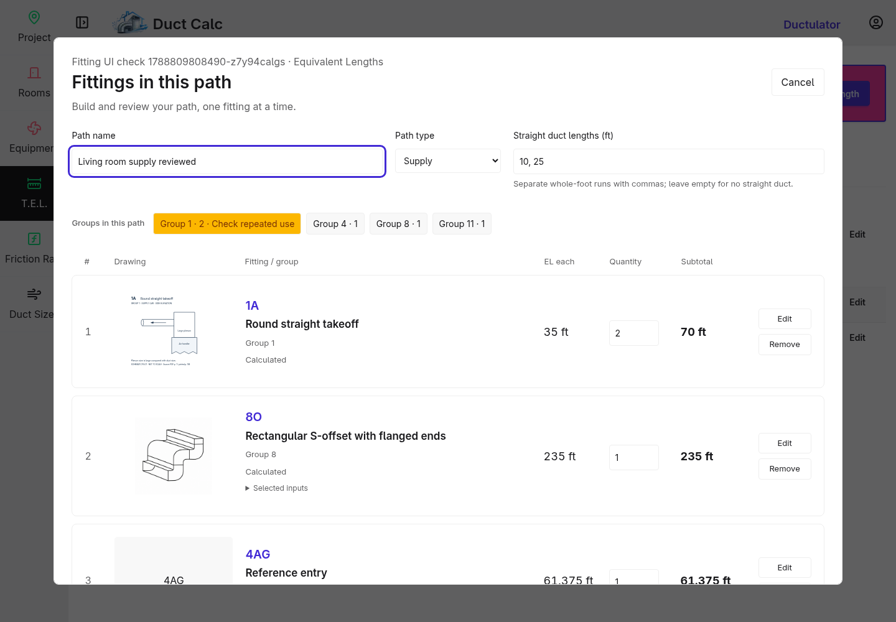
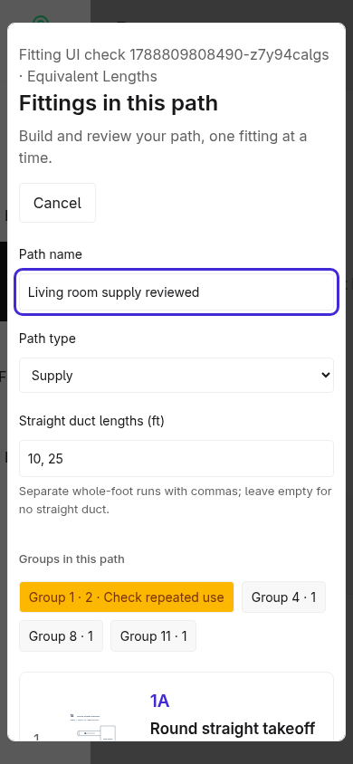
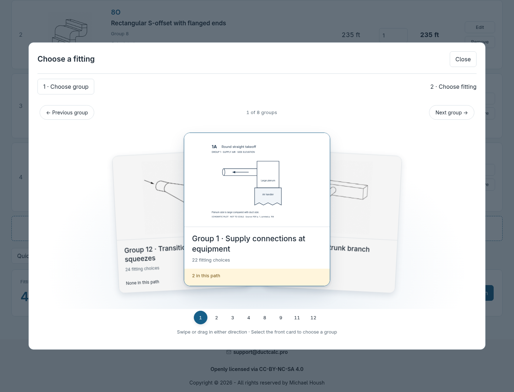
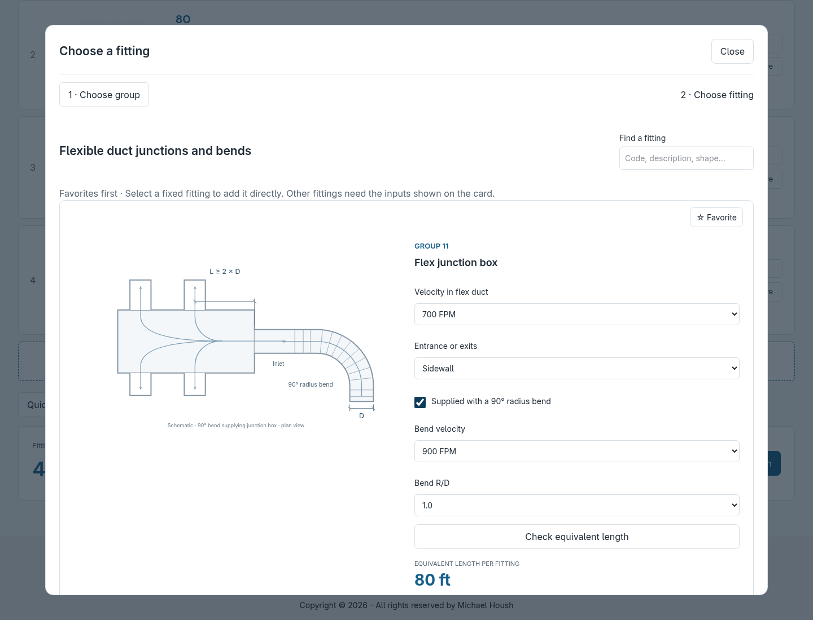
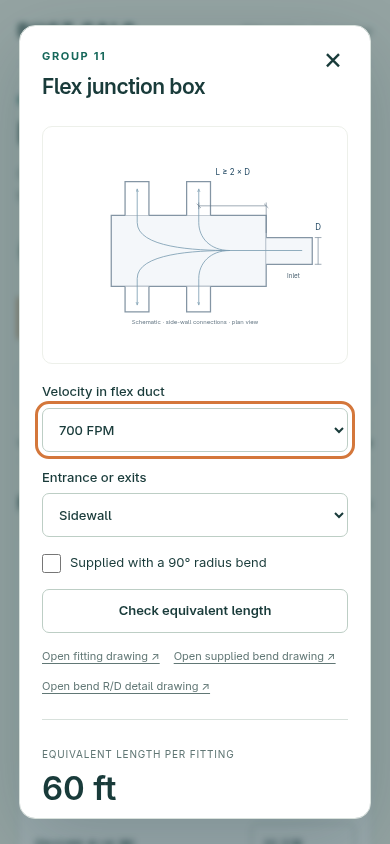
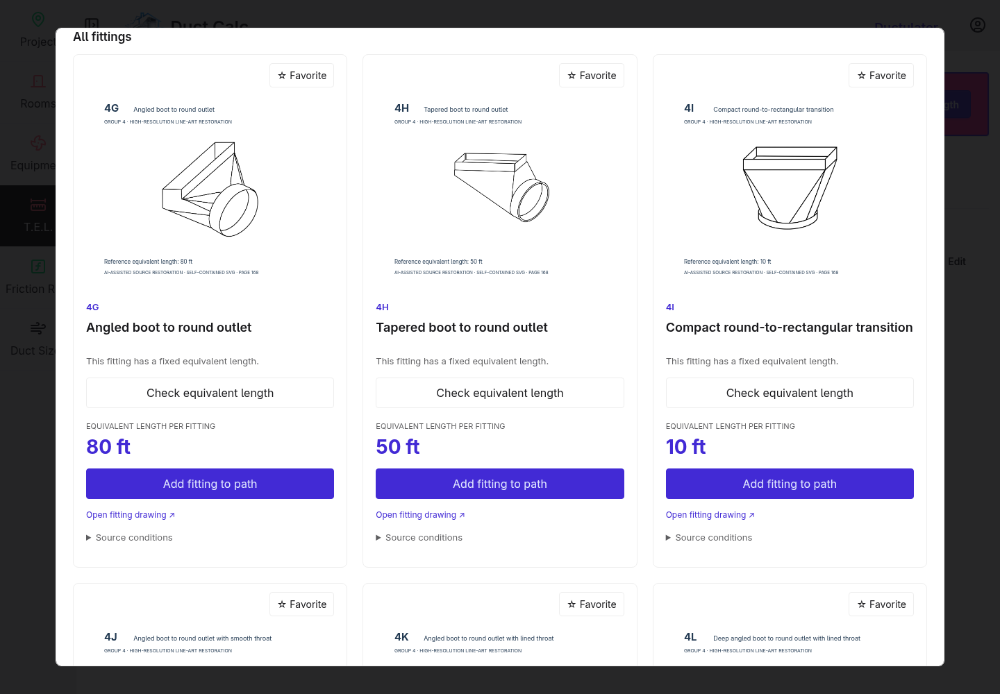
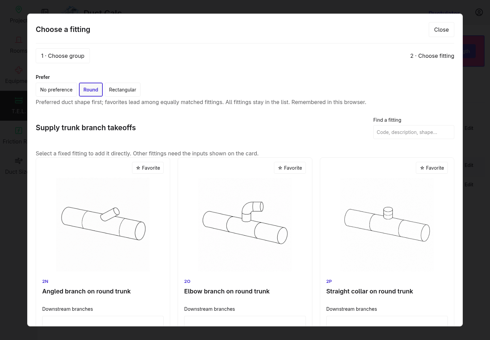
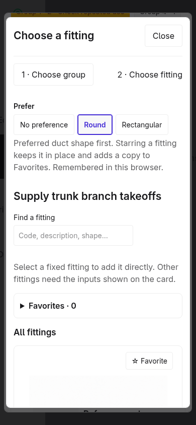
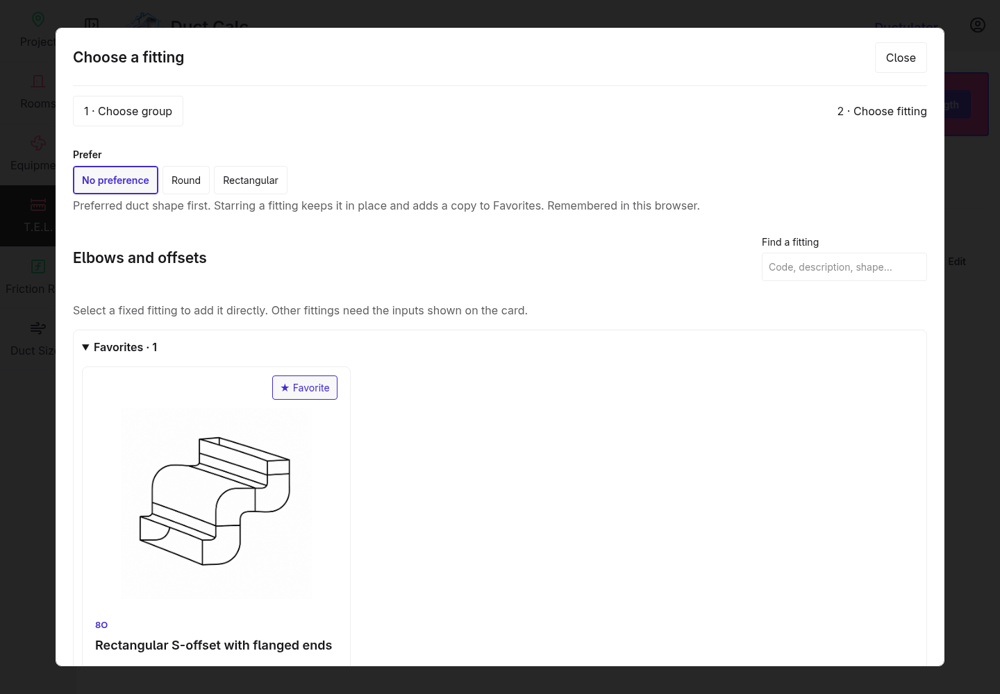
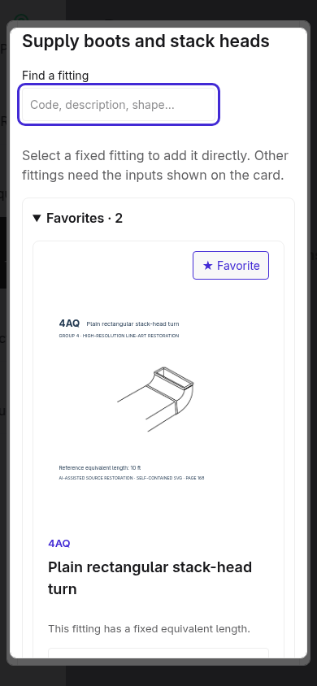

# Fitting picker integrated into the application

The agreed `path-catalog.html` prototype is now implemented in the Swift application.
Open a project, choose **Equivalent Lengths**, then **+** or **Edit**. The + opens the path modal. **From template**, beside **Groups in this path**, matches Continue, using the purple secondary button color in Dracula, and carries the entered path name and straight duct lengths into a guided flow inside the same dialog. **Back to path** restores the original form and fitting rows.
The path editor opens in a modal over the project's Equivalent Lengths list: **88% of
viewport width and height on desktop**, expanding to 96% width and 94% height on mobile.
**Save path** returns to the updated list. Use its **Edit** link to reopen recorded entries.
Cancel or Escape returns to the list, asking before discarding unsaved changes. Escape
inside a fitting picker or edit dialog closes only that child dialog. Failed saves leave
the editor and draft open.

The [development catalog review page](fitting-catalog-review.md) lets you inspect and
save duct-shape classifications directly to the source catalog.

## What is implemented

- The prototype's tall path rows, drawing-led Add fitting dialog, three-card looping
  group carousel, favorite copies, inline conditional inputs, and fitting totals.
- **Prefer: No preference / Round / Rectangular** reorders one continuous list; it
  adds no sections and hides no fittings. Direct matches come first, followed by mixed
  connections/shape-neutral schematics, then other shapes. Source order breaks ties;
  No preference restores source order. Favoriting never changes this order.
  Group 2 uses **trunk shape**: Round puts **2N–2Q first**; Rectangular puts **2A–2M first**,
  including round branches on rectangular trunks. Group 4 uses audited boot/stack-head
  duct connections: Round starts **4G–4L**, Rectangular starts **4A–4F**. All 44 fittings
  stay available. See the [connection-shape audit](fitting-picker-duct-shapes.md).
  The browser remembers this presentation preference across groups and reloads; it is
  not stored on the project or inferred from selected fittings. Changing the toggle
  preserves card inputs, path entries, and calculations. If browser storage is blocked
  it lasts for the editor session.
- Fixed fittings add directly from their drawing. Quantity is edited in the path list.
- All 227 catalog choices use the Swift `FittingClient`. The browser contains no fitting tables.
- Quick reference entry retains the supplied fractional length and distinguishes it from
  a calculated fitting. Repeated rows stay separate.
- Save/reopen, rename, quantity edits, removal, and fitting edits work on real project paths.
- Favorites are stored per user in the database and shared across projects/devices.
  An always-visible **Favorites** area above the full list holds duplicate cards for the
  current group. Originals stay in the complete list. Starring a fitting keeps its position, scroll location, and
  inputs intact, while favorite copies are added above the list. Either copy can add to
  the path. Favorites save the fitting choice; each card starts at catalog defaults and
  has independent draft inputs. Search and shape ordering apply to both lists.
- Groups 1, 2, 3, 5, and 6 show non-blocking repeated-use warnings. Changing path type
  retains the draft and requires incompatible rows to be resolved before saving.
- 8O starts at **Mitered**. Group 11 has one **Velocity in flex duct** box control and
  retained, independent inputs for its optional supplied bend. Group 6 requires the
  appropriate branch or trunk contribution to be selected.





[Earlier full-page layout for comparison](images/fitting-picker/path.png)

















## Code ownership

| Location | Responsibility |
| --- | --- |
| `Sources/ViewController/Views/FittingPicker` | Project page, path rows, fitting cards, request parsing, and result/error presentation |
| `Sources/Styleguide/EditorDialog.swift` | Reusable large form-dialog markup |
| `Sources/Styleguide/GroupCarousel.swift` | Reusable looping selector and picker dialog markup |
| `Sources/Styleguide/SegmentedControl.swift` | Reusable native radio toggle with keyboard navigation |
| `Sources/Styleguide/PickerControl.swift` | Reusable labeled numeric, choice, and checkbox controls |
| `Sources/ProjectClient/Internal/FittingPaths.swift` | Authorized saving, source evaluation, saved-row preservation, and validation |
| `Sources/FittingClient/Resources/catalog.json` | Explicit duct-shape classification and review status for every fitting |
| `Sources/ManualDCore/Fittings.swift` | Shared typed inputs, snapshots, and path-entry contracts |
| `Sources/DatabaseClient` | Additive saved-row metadata, project ownership lookup, and per-user favorites |
| `Public/js/fitting-path.js`, `group-carousel.js` | Interaction state, gestures, requests, quantities, and totals |
| `Public/css/fitting-path-modal.css` | Desktop/mobile editor dimensions and spacing |
| `Public/css/fitting-favorites.css` | Always-visible favorite-copy layout |
| `Public/css/picker-preference.css` | Scoped preference toggle styles |
| `Public/css/fitting-path.css` | Scoped presentation ported from the agreed prototype |

The frozen prototypes are unchanged. The separate `/fittings` preview has been retired;
that URL directs users to their projects. Catalog calculation and HTML fragment endpoints
remain available to the integrated editor.

## Existing data and saving

The existing fitting JSON keys (`group`, `letter`, `value`, `quantity`) are retained.
Optional `fitting` metadata adds a durable row ID, origin, and calculation snapshots.
Old rows decode without that metadata and preserve their historical lengths and quantities.
No rewrite of existing paths is performed during startup. The only new table is
`fitting_favorite`, associated with the user.

Untouched saved entries are loaded from the authorized server record, including existing
catalog snapshots. A rename or quantity change does not re-evaluate them. New or explicitly
edited catalog fittings are evaluated by Swift at save time; browser-supplied lengths and
calculation snapshots are not authoritative. Edited rows retain their durable identity.
Reference-entry edits preserve the supplied value and record that origin.

Saving checks project ownership, path ownership, eligibility, quantities, and finite
values. A changed baseline is rejected rather than silently replacing another saved edit.
Errors leave the in-page draft intact. Navigating away with unsaved changes prompts the
browser's standard confirmation. Straight duct retains the application's existing
whole-foot representation; fitting lengths retain fractional precision.

CSV paste/upload and project-specific input suggestions remain follow-up work. The
reference-entry CSV contract is still a proposal in the implementation plan.

## Running and checking it

The isolated review app runs on remote port **8081**. Forward that port through SSH and
open `http://localhost:8081/projects`. Sign up or log in, then create/open a project and
choose Equivalent Lengths. Screenshots above use disposable review data.

```sh
ssh -N -L 8081:localhost:8081 michael@YOUR_HOST
```

From this checkout with Swift 6.2:

```sh
swift run App serve --hostname 0.0.0.0 --port 8080
```

For Docker, use a separate directory for the review database so restarts preserve review
accounts and paths. The current host directory is `/tmp/fitting-integration-review`.

```sh
docker run --rm -v "$PWD:/workspace" -w /workspace swift:6.2-noble swift build --jobs 4
mkdir -p /tmp/fitting-integration-review
docker run --rm --name fitting-picker-preview -p 8081:8080 \
  -e SQLITE_PATH=/review-data/db.sqlite \
  -v /tmp/fitting-integration-review:/review-data \
  -v "$PWD:/workspace" -w /workspace swift:6.2-noble \
  .build/debug/App serve --hostname 0.0.0.0 --port 8080
```

Stop the existing review container with `docker stop fitting-picker-preview` before
starting another on that port. The review database is separate from the repository's
normal development database.

Validation: **138 Swift tests in 31 suites** passed. Database tests cover mixed legacy,
entered, and calculated paths; save/reopen and preserved snapshots; durable edited IDs;
wrong-owner, forged saved-row, and stale-baseline rejection; Group 6 selection; and
per-user favorites. The project-view snapshot now links Add/Edit to the integrated editor.

Repeatable browser checks require Playwright with Chromium. Run against a disposable
development database: the first script creates a test account and project; the second
uses that test session to check server authority and saved-path edge cases.

```sh
FITTING_APP_URL=http://localhost:8081 node scripts/check_fitting_path.cjs
node scripts/check_fitting_path_edges.cjs
node scripts/check_fitting_preference.cjs
node scripts/check_fitting_modal.cjs
node scripts/check_fitting_favorites.cjs
```

If Playwright is installed outside the checkout, set `NODE_PATH` to its `node_modules`
directory. The scripts check real save/reopen/edit flows, fractional reference lengths,
quantities, favorites across reloads, Group 11 controls, Group 6 saved contributions,
server-authoritative calculations, row identity, stale-save rejection, carousel looping,
and desktop/mobile layouts. The preference check covers ordering, mixed connections,
Group 2 trunk-shape ordering, stable catalog order when favoriting, searches across shapes, unchanged card inputs and saved paths,
keyboard navigation, mobile layout, reload persistence, and blocked browser storage.
The modal change passes all **15 Swift view and picker tests**. Browser flows save back
to the list and reopen through its Edit link. The modal check verifies viewport sizing,
child-dialog dismissal and focus restoration, accepted/declined discard, failed-save
retention, and cancellation with no changes. The favorites check verifies the exact
scroll → star → add sequence, favorites visible on group load, unchanged card coordinates
when copies are added, adding from both copies, independent conditional inputs, search, mobile layout,
Group 11 copy controls, keyboard focus restoration, and failed favorite writes. The catalog-review update passes **144 Swift tests in 32 suites**, with every browser
card checked against the authored catalog and separate persistence/concurrency coverage. Temporary test session data and screenshots are written to `/tmp`.

### Common Group 8 radius default

New round elbow drafts use **R/D 1.0** and **90°** for 8A smooth, four-/five-piece,
and three-piece variants. This also initializes R/D when one of those constructions
is selected for 8L/8M round double elbows, including favorite copies. Explicit
choices and saved path values remain intact; missing submitted values still require
input. Other radius controls retain their existing defaults, including 8O Mitered.

Validated with 18 Swift round-elbow, double-elbow, and picker tests plus
`scripts/check_fitting_radius_defaults.cjs` against a disposable application.
