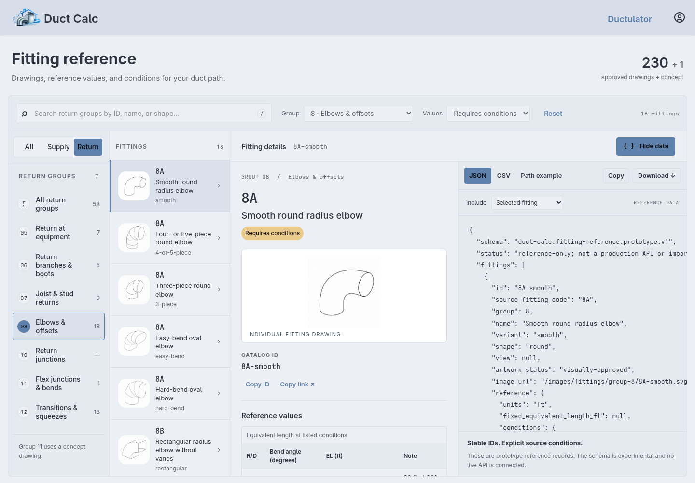
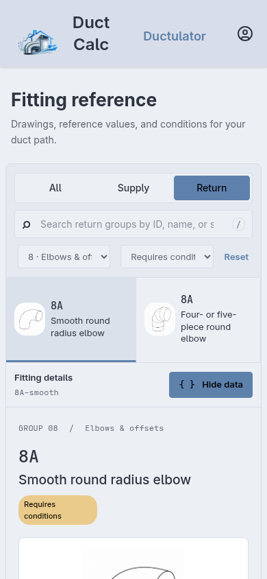

# Served fitting reference

`GET /fittings` serves the approved combined group → fitting → reference layout.
It is independent of projects and accepts guests. The All / Supply / Return
control stays in the first sidebar header, moving to the toolbar on mobile.
The production page uses the shared `MainPage` shell, `Navbar`, footer, and
saved user theme. Its scoped stylesheet uses the site’s DaisyUI theme tokens;
SVG drawing paper stays white for legibility. Page-specific assets load through
`MainPage` without changing other pages. The superseded reference design lab has
been removed.

The view controller uses its existing `isLoggedIn` helper (via
`AuthClient.currentUser`) to enable the optional JSON/CSV inspector and exports.
Guest visitors see the complete reference and a sign-in link. Login returns to
the same fitting and filters, with the requested data format open. A direct
`data=json` query does not enable data tools for a guest. This is a convenience
feature for signed-in users: the underlying reference, SVGs, and catalog assets
are public, and no private catalog or live API is introduced.

The typed `FittingsQuery` holds optional `system`, `group`, `fitting`, `q`, `type`,
and `data` fields. The browser normalizes unsupported values and updates the URL.
For example, `/fittings?system=supply&group=8&fitting=8A-smooth` opens an elbow;
adding `data=csv` opens its CSV record when signed in. JSON/CSV export schemas
and the path-entry example remain experimental. Source-value audit limitations
and the Group 11 concept status carry over from the prototype. Group 13 is excluded.

## Authentication and navigation

Session authentication runs globally after session storage middleware and before
the route handler. Public pages can recognize an existing user without requiring
login. Protected project/user routes retain their password authenticator and
login redirect. A deleted user's stale session is cleared and treated as anonymous;
database failures are still propagated. Login populates both `request.auth` and
the session so global session middleware preserves it; logout clears both.

`/fittings` responses are private/no-store and vary on Cookie and HX-Request.
HTMX requests to this page receive `HX-Redirect` to load its full
head, styles, and scripts, including the continuation from the existing login
form. All entry links use normal navigation. The navbar and home page link to
the reference, and the equivalent-length form supplies its current path type
instead of linking directly to the PDF. The PDF remains available inside the reference.

## Assets and verification

The app view is `Sources/ViewController/Views/Fittings/FittingsView.swift`.
Served scripts/styles live under `Public/fittings`; approved SVGs are referenced
in place under `Public/images/fittings`. To refresh the catalog after changing
its source manifests:

```sh
python3 scripts/build_fitting_picker_catalog.py --output Public/fittings
node scripts/check_fitting_reference.cjs
```

`swift test --filter FittingsRouteTests` exercises public access, actual login
cookies, public-page user recognition, protected-route guards, logout, stale
sessions, query round trips, and HTMX continuation. Middleware runs in tests as
it does in the application. View snapshots cover navigation link changes.


The generator reads the approved SVG manifests directly. Its default destination
still supports the separate picker prototype; `--output Public/fittings` writes
only the served reference catalog. The reference maintains its own table adapters
and the one Group 11 concept illustration it displays. It does not load or copy
picker UI code. The exported experimental schema identifiers remain unchanged.

## Integration with the fitting-client branch

The reference is integrated alongside the project fitting picker and development
catalog review. `SiteRoute.View.fittingReference(FittingsQuery)` owns public
`GET /fittings`; `SiteRoute.View.fittings(FittingPickerRoute)` retains the picker
fragment and review endpoints. The former picker landing page now lives at
`GET /fittings/picker`. The reference's full-document HTMX redirect and private
response headers apply only to the reference route, so picker POSTs still return
fragments.

Global session restoration recognizes signed-in reference visitors. Project/user
routes and both catalog-review routes retain their authentication guards, including
when the app runs in tests. FittingClient startup, dependency registration,
development authoring configuration, saved paths, preference sorting, and favorites
remain intact. The current path editor and legacy form both link to the reference;
the current editor updates the link's system filter when its path type changes.
The combined navigation/project snapshots pass without replacing the path editor.

The reference still exports the artwork-manifest transcription. The reviewed
`Sources/FittingClient/Resources/catalog.json` remains the separate, newer source
of calculation behavior. Its **189 reviewed classifications** were preserved
byte-for-byte during integration. Adapting the reference to that catalog needs
explicit mapping of variant IDs, source tables, review status, and Group 11;
this merge does not reconcile the two data schemas. Shared artwork and the original
PDF remain in place. The reference retains its concept illustration under
`Public/fittings/concepts`; the picker's three Group 11 drawings under
`Public/images/fittings/group-11` are unchanged.

### Validation of the integrated application

- **150 Swift tests in 33 suites pass**, including actual session/login middleware,
  public reference queries, protected picker/review routes, fragment responses,
  catalog calculations, saved paths, and combined view snapshots.
- `node scripts/check_fitting_reference.cjs` passes for 231 records, 12 groups,
  artwork/source links, and lossless CSV/JSON exports.
- `scripts/check_fitting_reference_browser.cjs` passes guest access, real login and
  HTMX return state, persisted Nord theme, record/filtered downloads, path examples,
  logout, and mobile layout.
- The path, preference, favorites, edge-case, modal, and catalog-review browser
  checks pass against an isolated database and disposable review catalog. These
  include save/reopen, server-authoritative values, stale saves, stable favorites,
  modal cancellation, review bulk edits, and the path-aware reference link.

Run browser checks with Playwright available. The main path check writes temporary
session/project fixtures used by the following picker checks:

```sh
FITTING_APP_URL=http://localhost:YOUR_QA_PORT node scripts/check_fitting_reference_browser.cjs
FITTING_APP_URL=http://localhost:YOUR_QA_PORT node scripts/check_fitting_path.cjs
node scripts/check_fitting_preference.cjs
node scripts/check_fitting_favorites.cjs
node scripts/check_fitting_path_edges.cjs
node scripts/check_fitting_modal.cjs
```

See [catalog review validation](fitting-catalog-review.md#validation) for the
separate disposable-catalog authoring check.




