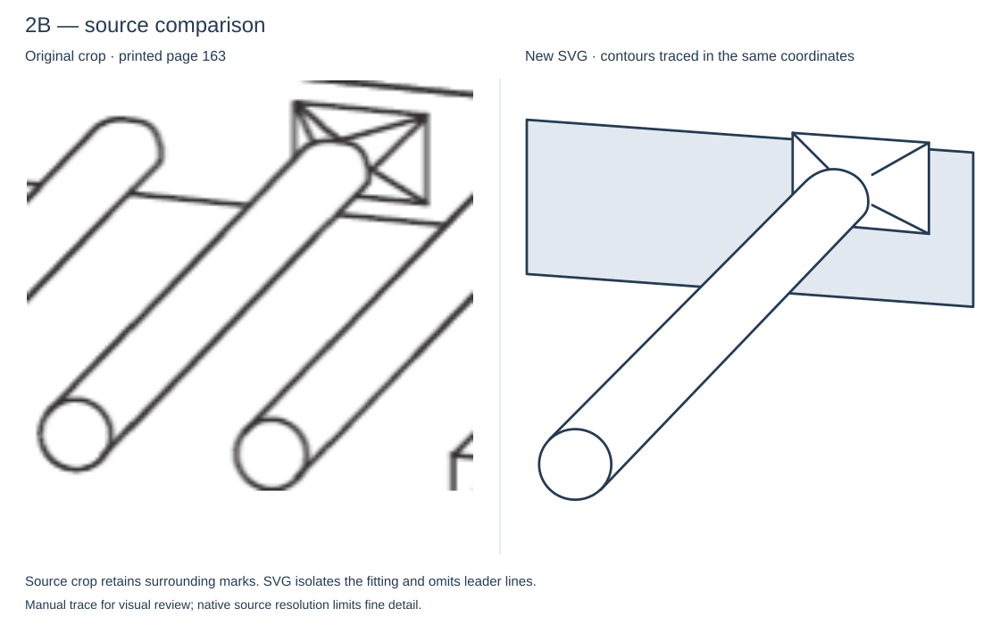
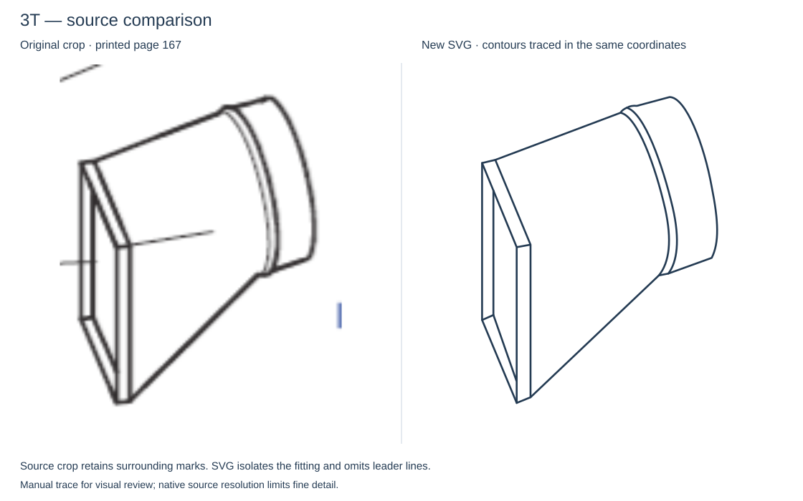

# Source-traced fitting review: 2B and 3T

These two replacements follow the source's contours and perspective. They
replace the earlier interpreted drawings at the same asset URLs and retain
the existing fitting IDs and reference values. The user accepted both refined
drawings for visual use (`visually-approved` in the catalog, backed by the
completed batch review).
This status records drawing acceptance; reference values are unchanged.

## 2B

The tapered base, sleeve angle, relative proportions and outlet outline now
follow the source. Adjacent branches and trunk lines are omitted from the SVG
to isolate 2B. The crop preserves those surrounding marks for comparison.
The refinement removes an unsupported double border around the base, adjusts
the taper seams where they meet the sleeve, and smooths the outlet outline.

## 3T

The replacement preserves the tall rectangular flange, asymmetric transition
and narrow curved collar. The earlier drawing's invented oval outlet has been
removed. Source leader lines are omitted; flange and collar edges are retained.
An overlapping diagonal at the rectangular flange has also been removed, and
the collar seam now meets the outer contour at a shared endpoint.

## How these were made

Native-resolution source images were extracted with Poppler `pdfimages -png`.
The committed PNG references are unretouched rectangular crops from those
images, with no upscaling. The comparisons enlarge them for inspection.

| Fitting | Extracted image index | Printed page | Crop x, y, width, height in pixels |
| --- | --- | --- | --- |
| 2B | 14 | 163 | 176, 307, 136, 125 |
| 3T | 32 | 167 | 574, 737, 112, 151 |

Manual SVG contours in `scripts/fitting_source_traces.py` use coordinates at
four times the crop dimensions. Both comparison panels use the same scale.
The standalone SVGs contain vector paths only; reference images are embedded
only in the comparison sheets. No automatic tracing or AI image generation
was used. Fine detail remains limited by the source scan's resolution.

Run `python3 scripts/generate-fitting-complex-pilot.py` to regenerate all pilot
assets, the catalog and both comparison sheets. Reference crops are committed
inputs and are not overwritten by that command.

The rest of the pilot has not been retraced. These accepted drawings establish
the source-tracing approach for the remaining difficult drawings.
