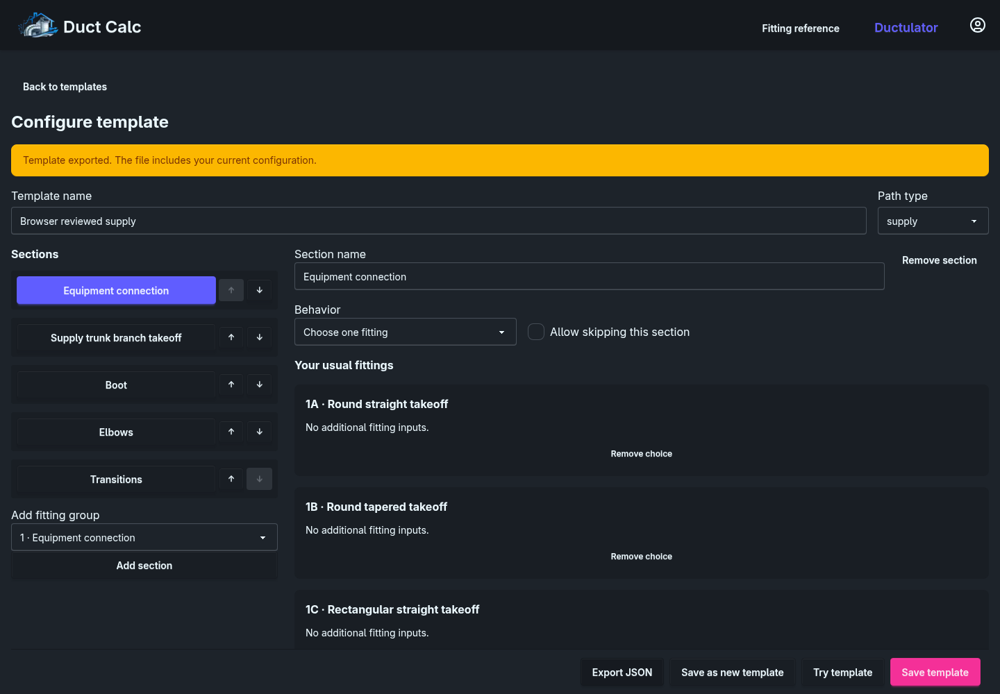
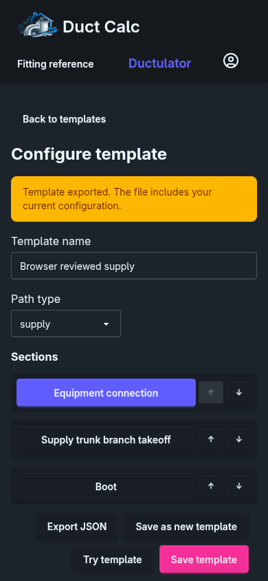
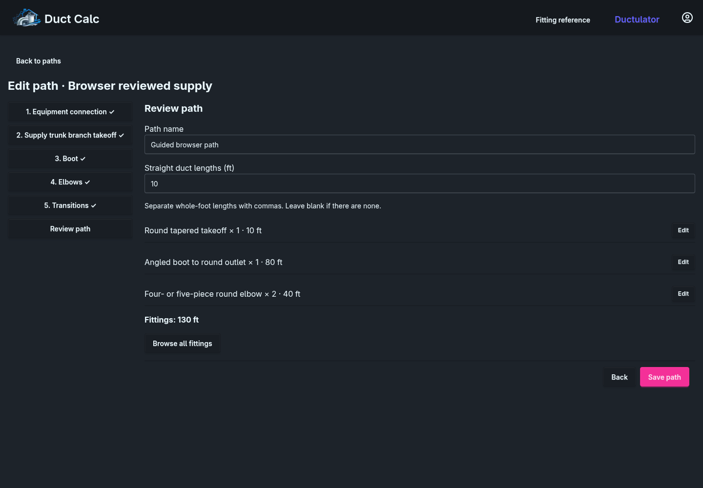
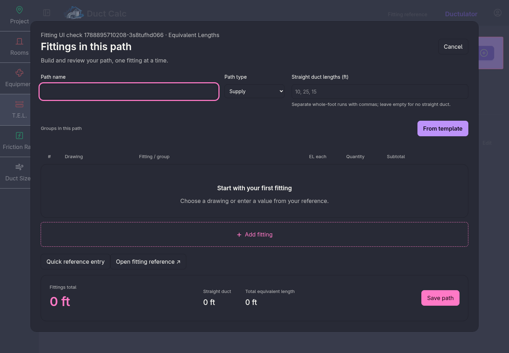
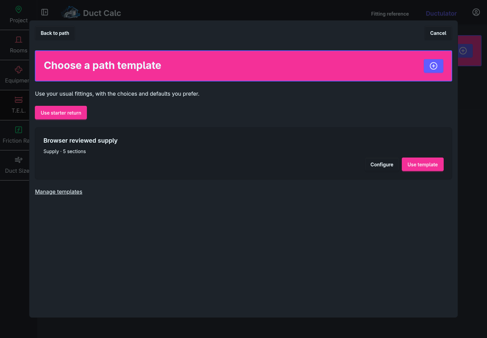
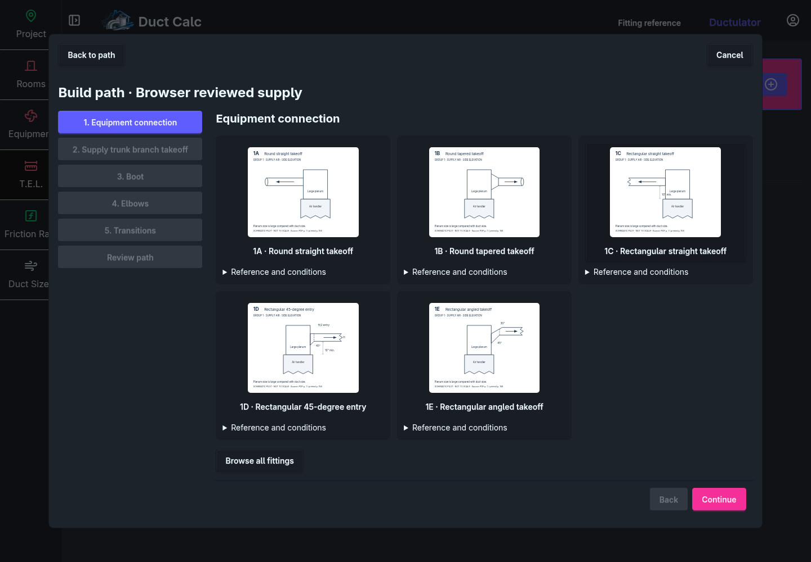

# Guided path templates in the Swift app

Status: the first production implementation is in the Swift application.
Configuration covers every eligible fitting group. Account → Path templates
opens the editor; Equivalent Lengths → + → From template starts a guided path.

The implementation includes user-owned template storage with revision checks,
starter templates, section and choice editing, reordering, independent Try,
guided navigation, authoritative Swift evaluation, path saving, and reopening.
The template list uses the app header and plus-button modal, with project return
links. Template pages use the app's full-width layout and button styling.
JSON export/import creates independent copies after preview and validation; see
[sharing templates](path-template-sharing.md).
The interface uses the existing theme and semantic styles. Fractional fitting
lengths also work in the existing manual form.

Two additive migrations create template storage and add an optional template
snapshot to saved paths. Legacy fitting rows decode without invented metadata.
Guided rows retain their identity, explicit inputs, per-fitting length, and rule
revision. Reopening and saving unchanged inputs preserves the stored calculation.

The template configurator lists 231 artwork definitions and currently has guided
input controls for 47 cases, including every starter-template choice. Other
choices can stay in a configuration but cannot be added by the guided flow yet.
Use the existing project picker for those fittings.

After integration into `codex/fitting-client`, `TemplateFitting` describes the
template JSON/form format. `TemplateFittingClient` validates that format and maps
supported inputs to the current `FittingClient`. The application injects its
prepared client, so template calculations use the same engine and reviewed runtime
catalog as the ordinary picker. The adapter preserves the full current calculation
snapshot on guided rows, alongside the template inputs needed for reopening.
It does not evaluate the older template catalog's numeric table values.

`Sources/FittingClient/Resources/template-catalog.json` supplies template identities
and supported form options. `scripts/build_swift_fitting_catalog.py` writes only
that file. It cannot overwrite `Resources/catalog.json`, which retains all 189
reviewed duct classifications and the Group 8 R/D 1.0 default. The template editor's
broader input mapping remains follow-up work.

The + add button opens the picker modal. From template appears inside that
modal beside Groups in this path for new paths. It carries the path name and
straight duct lengths through saved-template or starter-template selection into
the guided flow. Template selection and the guided steps replace the contents of
the same dialog. Back to path restores the original fields and fitting rows.
Edit selects the matching editor for a saved path,
and the ordinary picker rejects writes to template paths to preserve their section
metadata. The public fitting reference remains available at `/fittings`.

The delivery plan below records the agreed behavior and architecture. Broader guided input support and visual review across additional themes and
screen sizes remain follow-up work. The existing picker retains quick entry and
favorites.

## Product scope

A template belongs to a user and describes an ordered supply or return workflow.
Users can create, duplicate, rename, delete, and try templates, add or remove
steps, reorder them, and narrow each step to their usual fittings. Start with
the reviewed supply and return templates so configuration is optional.

Each step has a name, fitting group, ordered fitting choices, and a behavior:

- Choose one fitting. A resolved selection adds quantity 1 and advances.
- Choose multiple fittings. Add choices without advancing; finish with a
  "Done with [section]" action.
- Enter quantities. Show one quantity control per selected fitting, initially
  zero. Finish the section once all active fittings have valid inputs.

All behaviors support an explicit "Allow skipping" setting. A required quantity
section needs at least one positive quantity. Optional choice sections show
their choices immediately, with Skip in the bottom navigation.

Use the catalog's supply/return eligibility throughout the editor and server
validation. The current catalog groups are:

| Path type | Eligible groups |
| --- | --- |
| Supply | 1, 2, 3, 4, 8, 9, 11, 12 |
| Return | 5, 6, 7, 8, 10, 11, 12 |

Group 13 is outside the path-fitting catalog. Supporting configuration across
these groups does not establish that every source calculation is verified.
Show unavailable cases with their reason; never substitute a different rule or
let an unresolved calculated fitting reach a saved path.

The editor exposes only defaults that the fitting definition supports. "Ask for
each path" leaves an input unanswered. It does not expose formulas, arbitrary
branching logic, or custom form fields. Shape buckets organize fitting choices;
each step can include both round and rectangular variants, so a path can change
shape. A template does not impose a single shape on the whole path.

## Preserve the reviewed flow

- Fixed or fully resolved choices add directly with quantity 1. Ask for details
  only when needed for a calculation or when the user explicitly edits a row.
- Keep Back and Skip beside the section's completion action at the bottom.
  Use "Clear and skip" when the section already contains entries.
- Allow revisiting sections without losing inputs or adding duplicate rows.
  Editing an existing row stays in its section; choosing a single fitting
  replaces that section's selection and advances.
- Quantity and multiple-choice sections stay open while users make changes.
  Changing a quantity never causes automatic advancement.
- Focus the next section heading after automatic advancement. Preserve ordinary
  keyboard activation, visible focus, and reduced-motion preferences.
- Provide "Browse all fittings" when the usual choices do not cover a path.
  Adding an exception changes the current path only.
- Apply defaults only when creating a new fitting draft. Preserve edited and
  explicitly cleared inputs when going back or changing quantity to zero and
  then restoring it.
- An active fitting with missing inputs blocks completion. Quantity zero omits
  that fitting from the saved rows; it does not create a zero-length fitting.
- Keep a final path review with an explicit Save. Auto-advancement does not save
  a path or edit the source template.

## Starter templates

The following labels are printed source codes. Store stable catalog variant IDs
separately, especially for Group 5 and the two 8A constructions.

| Supply step | Usual choices | Behavior |
| --- | --- | --- |
| Equipment connection, Group 1 | Round 1A/1B; rectangular 1C/1D/1E | Choose one, required |
| Supply trunk branch takeoff, Group 2 | Round 2N/2O/2P/2Q; rectangular 2A/2B | Choose one, optional |
| Boot, Group 4 | 4G/4Q/4R | Choose one, required |
| Elbows, Group 8 | 8A four- or five-piece 90°; 8A three-piece 45° | Quantities, optional |
| Transitions, Group 12 | 12J/12S/12T/12U | Choose multiple, optional |

| Return step | Usual choices | Behavior |
| --- | --- | --- |
| Equipment connection, Group 5 | Round 5B/5D/5E; rectangular 5E/5F/5H/5I/5J | Choose one, required |
| Return branch / boot, Group 6 | Round 6I/6J/6K/6L/6M/6N; rectangular 6F/6H | Choose one, required |
| Elbows, Group 8 | Same two 8A constructions | Quantities, optional |
| Transitions, Group 12 | 12J/12S/12T/12U | Choose multiple, optional |

For the Group 2 section, retain the prompt "Do you want to add a Supply trunk
branch takeoff to the path?" Display the choices immediately below it.

The 90° elbow starts with R/D 1.0. The 45° choice is the separate three-piece
case, not a 45° setting on the four- or five-piece case. Both quantities start
at zero. Preserve these defaults in starter template data, not special cases in
view code.

Ask explicitly for required downstream takeoffs on the chosen fitting. Blank
and zero are different answers. Never derive this input from fitting quantity,
the number of path rows, or the template's number of steps.

## App integration and styling

The main application renders Elementary views through Vapor and uses Styleguide
components with DaisyUI themes. Build the production screens there.

- Keep the existing Add equivalent length picker action and provide From template
  beside the path list. Keep template management available from the account and
  project pages. The legacy form also retains its template entry link.
- Give template editing and guided path building their own project/account
  pages. The longer flow needs room for the section list and fitting drawings.
  Use the existing modal pattern for focused fitting details.
- On wide screens, show an ordered section list beside the active section. On
  small screens, use a compact section selector and a single content column.
- Reuse `PageTitleRow`, `LabeledInput`, `Select`, `Row`, `SubmitButton`, `Alert`,
  and the app's icon buttons. Share a fitting-card component between the editor,
  guided flow, and ordinary catalog picker.
- Use semantic `base-*`, `base-content`, `primary`, and `secondary` styles.
  Inherit the user's `data-theme` from `MainPage`, including dialogs and HTMX
  fragments. Do not carry over the prototype's independent palette or CSS.
- Keep the bottom navigation visible without covering content or keyboard
  focus. Give drawings an appropriate readable background without hardcoding
  light backgrounds for the surrounding controls.
- Follow the existing HTMX request and error patterns. A small JavaScript module
  may handle focus, local navigation, and draft interactions. Swift owns rule
  evaluation and final validation; do not ship a second calculation engine.

Try uses the same guided view and evaluator with a separate draft. Closing Try
does not create a project path or change the editor's unsaved template.

## Domain and persistence

Follow the boundaries in [FittingClient design](fitting-client-design.md) and the
legacy compatibility requirements in the
[fitting-picker plan](fitting-picker-implementation-plan.md).

| Owner | Production work |
| --- | --- |
| `ManualDCore/Fittings.swift` | Current picker identities, typed inputs, results, and saved calculations |
| `ManualDCore/TemplateFitting.swift` | Template form and JSON transport types |
| `ManualDCore/PathTemplate.swift` | User template, ordered steps, behavior, allowed choices, and typed input defaults |
| `FittingClient` | Current catalog and evaluation, plus the template input adapter and configuration validation |
| `DatabaseClient` | User-owned template CRUD and versioned path metadata with legacy-compatible decoding |
| `ProjectClient` | Authorized project lookup, template snapshot creation, final row evaluation, and path save |
| `ViewController` | Template management, editor, guided pages/fragments, form parsing, and error display |

Proposed template storage has an ID, owner ID, name, path type, schema version,
revision, ordered step configuration, and timestamps. Each step has a stable ID,
group, title, behavior, optionality, ordered fitting IDs, and supported defaults.
Use a versioned JSON configuration column in a new Fluent table. The database
owner relation uses the authenticated user, never a submitted owner ID.

Use stable step and row IDs to associate entries with sections after reordering
or editing. Repeated groups can be separate steps. Treat duplicate-group use as
guidance where the catalog calls for it, not a blanket prohibition.

Starting a path copies the template configuration and revision into its draft.
Saving retains that snapshot and row-to-step associations, plus each catalog
row's fitting identity, explicit inputs, fractional EL, and rule revision.
Editing or deleting the template cannot change existing path totals or prevent
them reopening. Existing saved paths remain editable without a template.

Keep the legacy group/letter/value/quantity projection for existing sizing and
exports while introducing row provenance. Decode rows without new metadata as
legacy, preserving their exact values. Do not infer fitting variants or inputs
from old codes. Load unchanged legacy values from the authorized stored path;
do not trust a browser-supplied legacy flag. Never silently recalculate saved
rows when the catalog changes.

Template writes validate group eligibility, fitting identity, behavior, duplicate
IDs, and permitted defaults. Type changes must identify incompatible steps and
require the user to resolve them before saving. An unavailable saved fitting
remains visible with an actionable explanation.

Use revision checks to reject stale template updates without discarding the
user's edits. Template reads, updates, deletes, Try, and project saves check
ownership at the server. Final save must also prevent duplicate submissions and
re-evaluate active calculated rows instead of accepting client-supplied totals.

## Delivery order and completion checks

1. **Preserve fitting values.** Accept fractional fitting lengths in both current
   create and edit forms. Verify parsing, save/reopen, quantity multiplication,
   and positive finite input validation. This first change needs no migration.
2. **Implement the fitting boundary and path metadata.** Add the shared types
   and FittingClient target, audit rule fixtures, introduce versioned row
   provenance, and preserve legacy totals. Establish the catalog inventory for
   every eligible group and make unsupported cases explicit.
3. **Persist configurable templates.** Add the model, migration, user-scoped
   client operations, starter data, and routes. Verify independent snapshots,
   revision conflicts, defaults, and ownership using database tests.
4. **Build the themed editor across all groups.** Add/remove/reorder steps,
   change behavior and optionality, select fittings, and edit supported defaults.
   Include duplicate, delete, and Try. Use the same fitting controls as the path
   flow so preview and actual use stay consistent.
5. **Connect guided paths to projects.** Implement the reviewed navigation,
   exceptions, final review, authoritative save, and reopen/edit behavior. Verify
   both starter workflows and custom templates using groups outside the starters.
6. **Verify production readiness.** Run Swift rule, database, route, and view
   checks. Review light/dark and other supported themes, narrow screens, keyboard
   flow, focus after advancement, validation failures, and repeated submission.
   Complete source checks for any fitting offered as calculable before rollout.

The core implementation for steps 1 through 5 is present. Step 6 includes Swift
regressions, regenerated CSS, and a production UI test against an isolated local
Swift app. Browser checks cover the reviewed desktop/mobile layouts, sharing,
Return submission, and quantity changes followed immediately by Done. A broader
review across every theme and expansion beyond the audited cases remain.

Key regression scenarios include clearing the default R/D and revisiting the
section; zero then positive elbow quantity; blank versus zero downstream count;
single-choice replacement; explicit row editing without advancement; Clear and
skip removing all section entries; exceptions surviving revisits; template
edits/deletion leaving saved paths intact; and fractional totals surviving save,
reopen, sizing, and exports. Verify route ownership with two different users.

The prototype remains the interaction reference in
`Public/prototypes/fitting-picker/guided-path.html`. Its JavaScript data and
calculations do not constitute audited production catalog data.

## Running the checks

Run `swift test` with the project's Swift 6.2 toolchain, or use its Docker test
image. Run `npm ci` and `npm run build:css` to regenerate the shared styles.

For the production UI check, start a separate local development instance with
an isolated SQLite file and port 18093. For example:

```sh
SQLITE_PATH=/tmp/path-template-qa.sqlite swift run App serve --env development --port 18093
```

In another terminal, run `npm run test:path-templates`. The script only accepts a
localhost/127.0.0.1 origin and creates synthetic accounts and a project in that
local database. It uses the actual Swift routes and evaluator with jsdom for the
interaction checks. It does not verify browser layout or rendering.

Also run `DUCT_TEMPLATE_QA_HTTP=1 npm run test:path-templates` to check browsers
that do not expose `crypto.randomUUID` over HTTP hostname/IP access. The UI uses
`crypto.getRandomValues` to generate UUIDs in that case. Fitting drawings and
labels share a selection button; opening reference details does not select one.

Covered interactions include both starter flows through save, theme inheritance,
R/D clearing and zero quantities, auto-advance, bottom Skip, editing another
fitting group, preserved path snapshots, stale template writes, and ownership.
They also cover form submission, quantity-blur/Done ordering, saving after a
section rename, JSON import preview and validation, independent copies, project
return links, and payload limits. Catalog validation and its error context are
owned by `TemplateFittingClient`; controllers use the same validation for preview and save.

The live check also disconnects clients during large page responses and confirms
the server stays responsive. The app's HTML response wrapper uses Vapor's managed
stream API to finish responses on success or error, including navigation away
while a page is still loading.

## Integration verification

The combined suite contains 179 Swift tests. It covers the adapter's use of the
injected current calculator, legacy and picker row preservation, template CRUD,
revision conflicts, independent imports, and guided snapshots. The navbar now
wraps on narrow screens so its reference link does not push the template editor
beyond the viewport. The updated project and account view snapshots include both
entry workflows.

The jsdom production check runs against an isolated app in both normal and HTTP
UUID-fallback modes. `scripts/check_path_templates_browser.cjs` adds real browser
coverage for JSON downloads/uploads, Try isolation, desktop/mobile layout, the
existing picker entry, guided save/reopen, and current calculation snapshots.
Run it with Playwright available and `FITTING_APP_URL` set to the disposable app.







The handoff browser check covers invalid straight lengths, names containing spaces
and punctuation, both template selection routes, and save/reopen. The modal check
asserts that the URL stays unchanged and no beforeunload warning appears during
selection or saving. It also covers failed-load retry, original draft restoration,
keyboard focus, nested Escape, and confirmed or declined cancellation.
Draft details apply only to a new guided path; saved paths retain their own values.







The From template action is a `type="button"` control with no navigation fallback.
The picker, template workspace, and modal controller use versioned script URLs so
an older cached script cannot restore the former page-navigation behavior.
`scripts/check_template_handoff.cjs` checks name-only, lengths-only, and combined
input with obsolete scripts intercepted at their old URLs. All cases retain the
same dialog and URL, carry the initial values, and show no leave-site prompt.

Guided saves check for an existing path with the same name and supply/return type
within the project, excluding the path being edited. A duplicate names the conflict
and asks for a different name or an edit to the existing path. The draft stays in
the modal for retry. Regression coverage includes the reported 1B, 2Q with two
downstream branches, and 4R combination, duplicate creates/renames, same-name edits,
and successful save after changing the name. The existing path remains unchanged.
